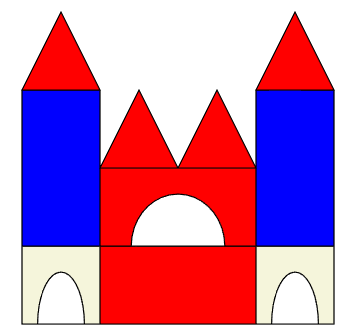

# Xalingo Builder - Render Pieces to PDF

Este projeto gera um arquivo PDF com a renderização de cada peça definida no arquivo `pieces.json` usando o `constructions.json`.

## Instalação

1. Instale as dependências:
   ```
   pip install -r requirements.txt
   ```

## Uso

Execute o script Python:
```
python render_construction.py
```

Isso criará um arquivo `construction.pdf` contendo a renderização visual de todas as peças.



## Descrição

- Cada peça é desenhada com base em seu formato (square, triangle, arc), largura, altura e cor.
- As formas são escaladas por um fator de 65 pixels por unidade para refletir a peça física.
- As peças são arranjadas em uma grade no PDF.

## Troubleshooting

- Certifique-se de que o arquivo `constructions.json` está no mesmo diretório.
- Se houver erros de cor, verifique se as cores estão definidas no `color_map`.

## Licença e Aviso

Este projeto foi gerado por IA (GitHub Copilot). O código é aberto e de forma alguma se relaciona com a marca Xalingo ou qualquer empresa associada. É um projeto independente para fins educacionais e de demonstração.
